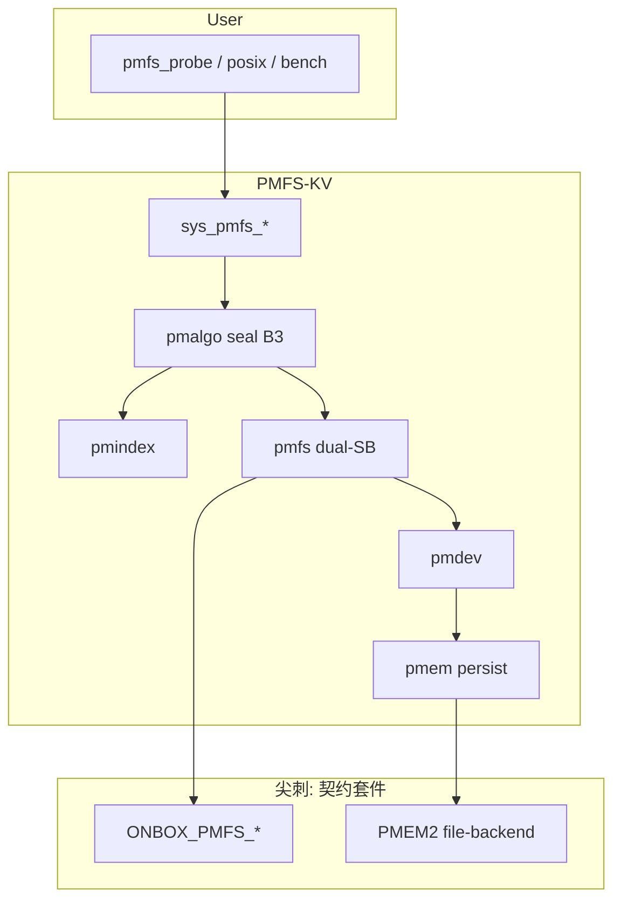

# 图：PMFS-KV 架构（Mermaid → 导出 PNG/SVG）

```mermaid
flowchart TB
  subgraph user [User]
    Probe[pmfs_probe / posix / bench]
  end
  subgraph kv [PMFS-KV]
    Sys[sys_pmfs_*]
    Algo[pmalgo seal B3]
    Idx[pmindex]
    Store[pmfs dual-SB]
    Dev[pmdev]
    Pmem[pmem persist]
  end
  subgraph gate [尖刺: 契约套件]
    C[ONBOX_PMFS_*]
    P2[PMEM2 file-backend]
  end
  Probe --> Sys --> Algo --> Idx
  Algo --> Store --> Dev --> Pmem
  Store --> C
  Pmem --> P2
```
